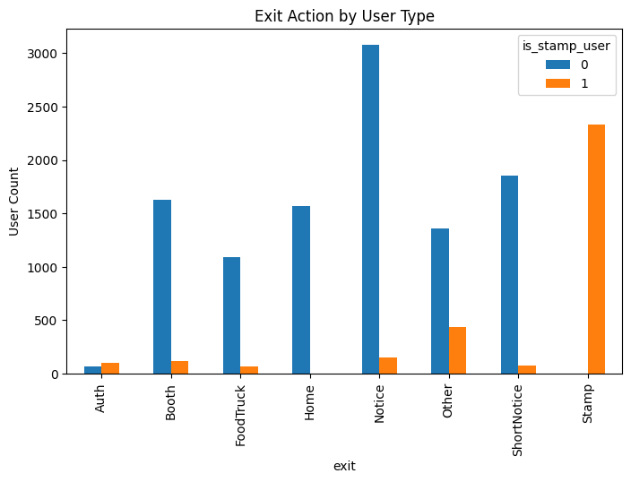

# 🎉 Festival Website Case Study  
### UX Research · UI Design · Cross-functional Collaboration · Analytics Planning

This repository documents the process and artifacts from my work on the CAU school festival website project.  
My contributions focus on **UX research**, **UI design**, **design-to-development collaboration**, and **analytics strategy planning**.

## 🔗 Link to site : https://lucaus.co.kr
## 👭 Team Repository : https://github.com/LUCAUS2025

---

## 📌 Overview
This project was a university festival website built collaboratively with a development team.  
I participated as a **UX/UI designer**, conducting research, redesigning flows and layouts, and supporting the implementation phase with structured design handoffs and visual QA.

While development & full analytics are handled by the engineering team,  
I am preparing an extended analysis using **GA4** and **server log data** as a future enhancement.

---

## 🧩 Project Scope
- **UX Research** (pain points, flows, heuristic checks)
- **UI Design** (Figma components, layout, visual system)
- **Design-to-Development Handoff**
- **UX QA + iteration with developers**
- **Analytics Planning (GA4 + log analysis) — In Progress**

---

## 🎨 UX & UI Contributions

### 1. UX Research
- Identified user needs and barriers from previous festival websites.  
- Conducted lightweight user interviews & synthesized pain points.
- Created improved user flows for navigation and ticketing information.
- Performed heuristic evaluation & usability checks.

### 2. UI Design
- Built a complete Figma component system (colors, typography, spacing rules).
- Designed key pages: home, schedule, map, booth sections.
- Delivered responsive layout guidelines for desktop/mobile.
- Created assets for marketing and promotions as needed.

---

## 🤝 Collaboration With Developers
Although I did not contribute to coding, I worked closely with the dev team by:

- Preparing structured design specs & handoff files.
- Reviewing implemented pages and checking alignment with the design system.
- Communicating layout issues, spacing rules, and visual polish needs.
- Capturing before/after screenshots for reference.

---

## 📊 Analytical Works -  Festival Website Log Analysis  
**Understanding User Engagement and Momentum in a Large-Scale Offline Event**

This project analyzes server access logs from a university festival website to understand how users interact with a time-sensitive, high-traffic service.  
The goal was not just to visualize traffic, but to identify **high-value user segments**, **engagement patterns**, and **drop-off points** that directly inform product and UX decisions.

By combining behavioral data with event context, this analysis reveals how *momentum* is created—and lost—during short-lived but intense user journeys.

### Context
- Event: University Festival (multi-day, high concurrent traffic)
- Platform: Official festival website (mobile-first usage)
- Role: UX/UI Designer & Data Analyst
- Objective: Improve engagement, retention, and post-action continuity

### Key Questions
- Which users demonstrate the highest engagement and intent?
- How do interaction patterns differ between casual visitors and active participants?
- Where does user momentum peak—and why does it suddenly drop?

### Key Insights

#### 1. High-Value Users Show Distinct Behavioral Patterns
Users who participated in the **Stamp Tour (gamified feature)** recorded  
**3.5× higher interaction rates** than general visitors.

 </img>

These users voluntarily engaged with multiple booths and features, indicating:
- High intrinsic motivation
- Strong alignment with festival goals
- Potential as a “VIP segment”

#### 2. The “Completion Cliff” Problem
Despite their high engagement, Stamp users showed an **abrupt drop-off immediately after task completion**.

 </img>

**Finding:**  
The interface treated *stamp completion* as the **end of the journey**, rather than a transition point.

**Interpretation:**  
User momentum was built successfully—but not sustained.

#### 3. Momentum Is a Design Asset
Behavioral patterns suggest that **post-completion moments** are critical opportunities:
- Users are most emotionally invested
- Willing to explore additional actions
- Highly receptive to recommendations

Failing to guide users at this moment results in lost engagement potential.

### Data & Methodology
- Data Source: Server access logs
- Tools: Python (Pandas, NumPy), Jupyter Notebook
- Methods:
  - Session-based behavior grouping
  - Interaction frequency comparison
  - Time-sequence analysis of user actions
- Visualization: Matplotlib / Seaborn

### Design & Product Proposal
**“Keep the Momentum” Strategy**

Introduce contextual prompts immediately after stamp completion, such as:
- Nearby food trucks
- Popular booths
- Limited-time events

This reframes completion as a **gateway**, not a conclusion—extending user engagement beyond the original goal.

### Why This Matters
This project demonstrates how:
- Log data can reveal **latent user intent**
- UX decisions directly impact behavioral continuity
- Short-lived services still benefit from long-term engagement thinking

The findings are applicable to any event-based or campaign-driven digital service.

### Tech Stack
- Python
- Pandas / NumPy
- Jupyter Notebook
- Matplotlib / Seaborn

---

# ✨ Contact
lucyroh529@gmail.com  
[Portfolio site
](https://drive.google.com/file/d/1oYXgYKXSfqMSNLQ3CQgdVcVjDctKBclb/view?usp=sharing)

